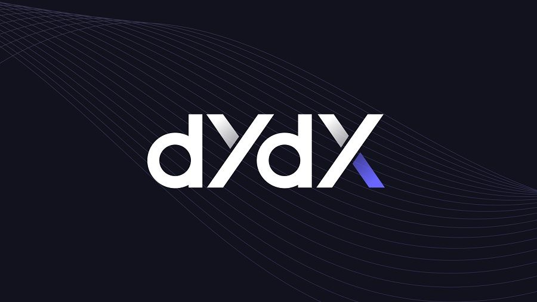

# DyDx Solo Margin - flashloan

<a name="readme-top"></a>

[![Contributors][contributors-shield]][contributors-url]
[![Forks][forks-shield]][forks-url]
[![Stargazers][stars-shield]][stars-url]
[![Issues][issues-shield]][issues-url]
[![MIT License][license-shield]][license-url]
[![LinkedIn][linkedin-shield]][linkedin-url]

<!-- PROJECT LOGO -->
<br />
<div align="center">
  <a href="https://github.com/Aboudoc/dydx-Flashloan.git">
    
  </a>

<h3 align="center">Solo Margin</h3>

  <p align="center">
    dydx Flashloan
    <br />
    <a href="https://github.com/Aboudoc/dydx-Flashloan"><strong>Explore the docs »</strong></a>
    <br />
    <br />
    <a href="https://github.com/Aboudoc/dydx-Flashloan">View Demo</a>
    ·
    <a href="https://github.com/Aboudoc/dydx-Flashloan/issues">Report Bug</a>
    ·
    <a href="https://github.com/Aboudoc/dydx-Flashloan/issues">Request Feature</a>
  </p>
</div>

<!-- TABLE OF CONTENTS -->
<details>
  <summary>Table of Contents</summary>
  <ol>
    <li>
      <a href="#about-the-project">About The Project</a>
      <ul>
        <li><a href="#built-with">Built With</a></li>
      </ul>
    </li>
    <li>
      <a href="#getting-started">Getting Started</a>
      <ul>
        <li><a href="#prerequisites">Prerequisites</a></li>
        <li><a href="#installation">Installation</a></li>
      </ul>
    </li>
    <li><a href="#usage">Usage</a></li>
    <li><a href="#Learn-more-about-dydx">Learn more about dydx</a></li>
    <li><a href="#DyDxSoloMargin-contract">DyDxSoloMargin contract</a></li>
    <li><a href="#initiateFlashloan-Function">initiateFlashloan Function</a></li>
    <li><a href="#callFunction-Function">callFunction Function</a></li>
    <li><a href="#Test">Test</a></li>
    <li><a href="#Forking-mainnet">Forking mainnet</a></li>
    <li><a href="#Note">Note</a></li>
    <li><a href="#roadmap">Roadmap</a></li>
    <li><a href="#contributing">Contributing</a></li>
    <li><a href="#license">License</a></li>
    <li><a href="#contact">Contact</a></li>
    <li><a href="#acknowledgments">Acknowledgments</a></li>
  </ol>
</details>

## Setup the project

```shell
npm init -y
npm install --save-dev hardhat
npx hardhat
```

```shell
npm i @openzeppelin/contracts@^4.3.2
```

### Built With

- [![Hardhat][Hardhat]][Hardhat-url]
- [![Ethers][Ethers.js]][Ethers-url]

<p align="right">(<a href="#readme-top">back to top</a>)</p>

## Usage

If you need testnet funds, use the [Alchemy testnet faucet](https://goerlifaucet.com/).

**This project shows how to swap, add and remove liquidity**

<p align="right">(<a href="#readme-top">back to top</a>)</p>

## Learn more about dydx

On DyDx the fees that you have to pay for flashloan is **2 wei**

<p align="right">(<a href="#readme-top">back to top</a>)</p>

## DyDxSoloMargin contract

First thing to do, set the address of the contract to call flashloan on dydx (`SOLO`)

Next, set up some state variable, event and struct: `flashUser`, `Log`, `MyCustomData`

<p align="right">(<a href="#readme-top">back to top</a>)</p>

## initiateFlashloan Function

- Initiate a `solo` contract at the address of `SOLO`
- We need the `marketId`
  Market ID's: 0 WETH; 1 SAI, 2 USDC, 3 DAI
- Calculate the amount that we will need to repay by using `_getRepaymentAmountInternal` provided by `DydxFlashloanBase.sol`
- Approve the SOLO contract to spend the repayment amount
- The way you request a flashloan on DyDx is by creating 3 actions:
  - Withdraw: using `_getWithdrawAction()`
  - Call callFunction(): using `_getCallAction()`
  - Deposit: back using `getDepositAction()`
- We also need `accountInfos[]` that we will get by calling `_getAccountInfo()`
- Once we created these 3 actions in `operations[]`, we submit it over to the `solo` contract by calling `operate()` and passing in the 3 actions and `accountInfos[]`

<p align="right">(<a href="#readme-top">back to top</a>)</p>

## callFunction Function

dydx will callback this function

- We only want the `solo` contract to be able to call this function, require it to restrict access
- Check that the initiator of the flashloan is `this` contract by requiring it
- Decode the `data` passed from the input
- From `MyCustomData` decoded get back the `repayAmount`
- Exctract also `bal` to make sure we ahve enough amount to repay back the flashloan
- Write custom code: Arbitrage. For the example we just set `flashUser` state variable and Log bal, repay and profit variables

<p align="right">(<a href="#readme-top">back to top</a>)</p>

## Test

<p align="right">(<a href="#readme-top">back to top</a>)</p>

## Forking mainnet

`hardhat.config.js`

```sh
  networks: {
        hardhat: {
          forking: {
            url: `https://eth-mainnet.alchemyapi.io/v2/${process.env.ALCHEMY_API_KEY}`,
       },
     },
  }
```

Note: Replace the `${}` component of the URL with your personal [Alchemy](https://www.alchemy.com/) API key.

```sh
npx hardhat test test/swapV3.test.js
```

<p align="right">(<a href="#readme-top">back to top</a>)</p>

## Note

This contract assumes that token0 and token1 both have same decimals

Consider Uniswap trading fee = 0.3%

### Further reading

<p align="right">(<a href="#readme-top">back to top</a>)</p>

### Sources

<p align="right">(<a href="#readme-top">back to top</a>)</p>

<!-- ROADMAP -->

## Roadmap

- [ ] Flashloan test
- [ ] More reading
- [ ] Arbitrage using dydx Flashloan

See the [open issues](https://github.com/Aboudoc/dydx-Flashloan.git/issues) for a full list of proposed features (and known issues).

<p align="right">(<a href="#readme-top">back to top</a>)</p>

<!-- CONTRIBUTING -->

## Contributing

Contributions are what make the open source community such an amazing place to learn, inspire, and create. Any contributions you make are **greatly appreciated**.

If you have a suggestion that would make this better, please fork the repo and create a pull request. You can also simply open an issue with the tag "enhancement".
Don't forget to give the project a star! Thanks again!

1. Fork the Project
2. Create your Feature Branch (`git checkout -b feature/AmazingFeature`)
3. Commit your Changes (`git commit -m 'Add some AmazingFeature'`)
4. Push to the Branch (`git push origin feature/AmazingFeature`)
5. Open a Pull Request

<p align="right">(<a href="#readme-top">back to top</a>)</p>

<!-- LICENSE -->

## License

Distributed under the MIT License. See `LICENSE.txt` for more information.

<p align="right">(<a href="#readme-top">back to top</a>)</p>

<!-- CONTACT -->

## Contact

Reda Aboutika - [@twitter](https://twitter.com/AboutikaR) - reda.aboutika@gmail.com

Project Link: [https://github.com/Aboudoc/dydx-Flashloan.git](https://github.com/Aboudoc/dydx-Flashloan.git)

<p align="right">(<a href="#readme-top">back to top</a>)</p>

<!-- ACKNOWLEDGMENTS -->

## Acknowledgments

- [Smart Contract Engineer](https://www.smartcontract.engineer/)

<p align="right">(<a href="#readme-top">back to top</a>)</p>

<!-- MARKDOWN LINKS & IMAGES -->
<!-- https://www.markdownguide.org/basic-syntax/#reference-style-links -->

[contributors-shield]: https://img.shields.io/github/contributors/Aboudoc/dydx-Flashloan.svg?style=for-the-badge
[contributors-url]: https://github.com/Aboudoc/dydx-Flashloan/graphs/contributors
[forks-shield]: https://img.shields.io/github/forks/Aboudoc/dydx-Flashloan.svg?style=for-the-badge
[forks-url]: https://github.com/Aboudoc/dydx-Flashloan/network/members
[stars-shield]: https://img.shields.io/github/stars/Aboudoc/dydx-Flashloan.svg?style=for-the-badge
[stars-url]: https://github.com/Aboudoc/dydx-Flashloan/stargazers
[issues-shield]: https://img.shields.io/github/issues/Aboudoc/dydx-Flashloan.svg?style=for-the-badge
[issues-url]: https://github.com/Aboudoc/dydx-Flashloan/issues
[license-shield]: https://img.shields.io/github/license/Aboudoc/dydx-Flashloan.svg?style=for-the-badge
[license-url]: https://github.com/Aboudoc/dydx-Flashloan/blob/master/LICENSE.txt
[linkedin-shield]: https://img.shields.io/badge/-LinkedIn-black.svg?style=for-the-badge&logo=linkedin&colorB=555
[linkedin-url]: https://www.linkedin.com/in/r%C3%A9da-aboutika-34305453/?originalSubdomain=fr
[product-screenshot]: https://ethereum.org/static/28214bb68eb5445dcb063a72535bc90c/9019e/hero.webp
[Hardhat]: https://img.shields.io/badge/Hardhat-20232A?style=for-the-badge&logo=hardhat&logoColor=61DAFB
[Hardhat-url]: https://hardhat.org/
[Ethers.js]: https://img.shields.io/badge/ethers.js-000000?style=for-the-badge&logo=ethersdotjs&logoColor=white
[Ethers-url]: https://docs.ethers.org/v5/
[Vue.js]: https://img.shields.io/badge/Vue.js-35495E?style=for-the-badge&logo=vuedotjs&logoColor=4FC08D
[Vue-url]: https://vuejs.org/
[Angular.io]: https://img.shields.io/badge/Angular-DD0031?style=for-the-badge&logo=angular&logoColor=white
[Angular-url]: https://angular.io/
[Svelte.dev]: https://img.shields.io/badge/Svelte-4A4A55?style=for-the-badge&logo=svelte&logoColor=FF3E00
[Svelte-url]: https://svelte.dev/
[Laravel.com]: https://img.shields.io/badge/Laravel-FF2D20?style=for-the-badge&logo=laravel&logoColor=white
[Laravel-url]: https://laravel.com
[Bootstrap.com]: https://img.shields.io/badge/Bootstrap-563D7C?style=for-the-badge&logo=bootstrap&logoColor=white
[Bootstrap-url]: https://getbootstrap.com
[JQuery.com]: https://img.shields.io/badge/jQuery-0769AD?style=for-the-badge&logo=jquery&logoColor=white
[JQuery-url]: https://jquery.com
